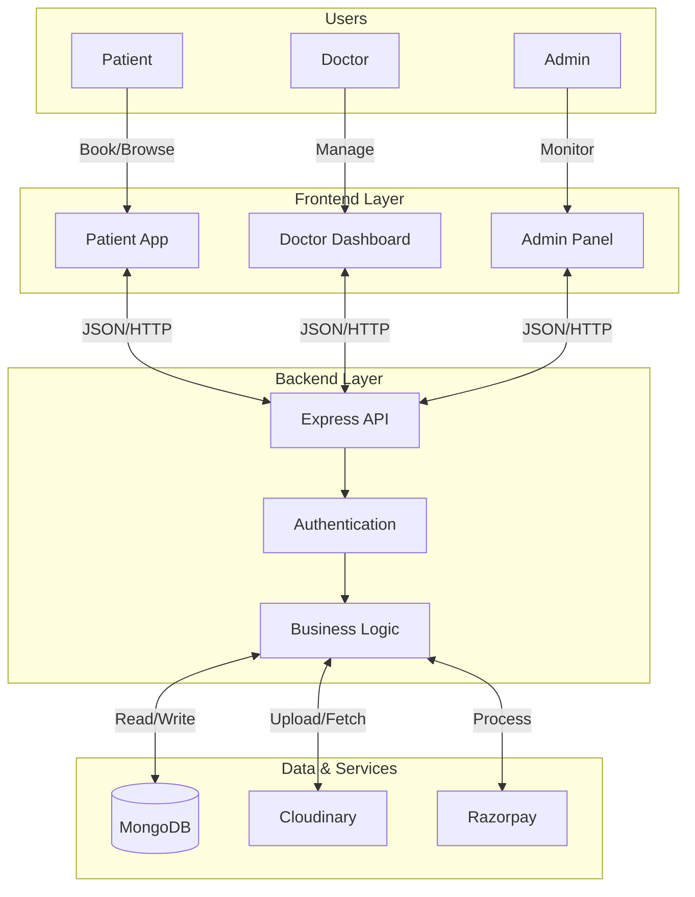

# 🏥 careNexus - Integrated Health System (CareNexus)


> **A comprehensive Doctor Appointment Booking Application built with the MERN Stack.**

[](https://reactjs.org/)
[](https://nodejs.org/)
[](https://expressjs.com/)
[](https://www.mongodb.com/)
[](https://tailwindcss.com/)

---

## 📖 About The Project

**careNexus** is a full-stack healthcare platform designed to streamline the process of booking medical appointments. It bridges the gap between doctors, patients, and administrators.

*   **Patients** can browse doctors, view profiles, and book appointments easily.
*   **Doctors** have a dedicated dashboard to manage their appointments, earnings, and profile.
*   **Admins** oversee the entire system, managing doctors, and monitoring platform activity.

---

## 🏗️ System Architecture



---

## ✨ Key Features

### 🩺 For Doctors
*   **Dynamic Dashboard**: Real-time overview of earnings, appointments, and patient statistics.
*   **Appointment Management**: Complete, cancel, or view details of appointments.
*   **Profile Management**: Update practice details, fees, address, and availability status.
*   **Authentication**: Secure login for doctors.

### 👨‍💼 For Admins
*   **System Overview**: specialized dashboard for platform analytics.
*   **Doctor Management**: Add new doctors, view doctor lists, and manage their availability.
*   **ALL Appointments**: Global view of all bookings across the platform.

### 👤 For Patients
*   **Easy Booking**: Intuitive interface to search for doctors by specialization.
*   **Doctor Profiles**: Detailed doctor information including experience, fees, and bio.
*   **User Profile**: Manage personal details and appointment history.
*   **Secure Payments**: Integrated with Razorpay for handling payments.

---

## 🛠️ Technology Stack

### Frontend (Client & Admin)
*   **React.js** (Vite) for fast and interactive UI.
*   **Tailwind CSS** for modern, responsive styling.
*   **React Router** for seamless navigation.
*   **Axios** for API communication.
*   **React Toastify** for user notifications.

### Backend (Server)
*   **Node.js & Express.js** for robust API development.
*   **MongoDB & Mongoose** for scalable database management.
*   **JWT (JSON Web Tokens)** for secure authentication.
*   **Bcrypt** for password hashing.
*   **Multer** for file handling.

### Services & Tools
*   **Cloudinary**: For image storage and management.
*   **Razorpay**: For secure payment processing.
*   **Dotenv**: For environment variable management.

---

## 🚀 Getting Started

Follow these instructions to set up the project locally.

### Prerequisites
*   Node.js (v14 or higher)
*   npm or yarn
*   MongoDB installed or Atlas URI

### 1. Clone the Repository
```bash
git clone https://github.com/AnkitGit-prog/carenexus-integrated-health-system.git
cd carenexus-integrated-health-system
```

### 2. Backend Setup
Navigate to the `backend` directory and install dependencies:
```bash
cd backend
npm install
```

Create a `.env` file in the `backend` folder with the following variables:
```env
PORT=4000
MONGODB_URI=your_mongodb_connection_string
JWT_SECRET=your_jwt_secret
CLOUDINARY_NAME=your_cloudinary_name
CLOUDINARY_API_KEY=your_cloudinary_api_key
CLOUDINARY_SECRET_KEY=your_cloudinary_secret_key
RAZORPAY_KEY_ID=your_razorpay_key_id
RAZORPAY_KEY_SECRET=your_razorpay_key_secret
ADMIN_EMAIL=admin@prescripto.com
ADMIN_PASSWORD=adminpassword
```

Start the server:
```bash
npm start
```

### 3. Admin Panel Setup
Open a new terminal, navigate to `admin` folder:
```bash
cd admin
npm install
```

Start the admin client:
```bash
npm run dev
```

### 4. Frontend Setup
Open a new terminal, navigate to `frontend` folder:
```bash
cd frontend
npm install
```

Start the user client:
```bash
npm run dev
```

---

## 📸 Screenshots

| Patient Home | Doctor Dashboard |
|:---:|:---:|
|  |  |

| Book Appointment | Admin Panel |
|:---:|:---:|
|  |  |

---

## 🤝 Contributing

Contributions are welcome! Please fork the repository and create a pull request.

1.  Fork the Project
2.  Create your Feature Branch (`git checkout -b feature/AmazingFeature`)
3.  Commit your Changes (`git commit -m 'Add some AmazingFeature'`)
4.  Push to the Branch (`git push origin feature/AmazingFeature`)
5.  Open a Pull Request

---

## 📄 License

Distributed under the MIT License. See `LICENSE` for more information.

---

## 📞 Contact

**Ankit Tiwari** - [GitHub Profile](https://github.com/AnkitGit-prog)

Project Link: [https://github.com/AnkitGit-prog/carenexus-integrated-health-system](https://github.com/AnkitGit-prog/carenexus-integrated-health-system)
